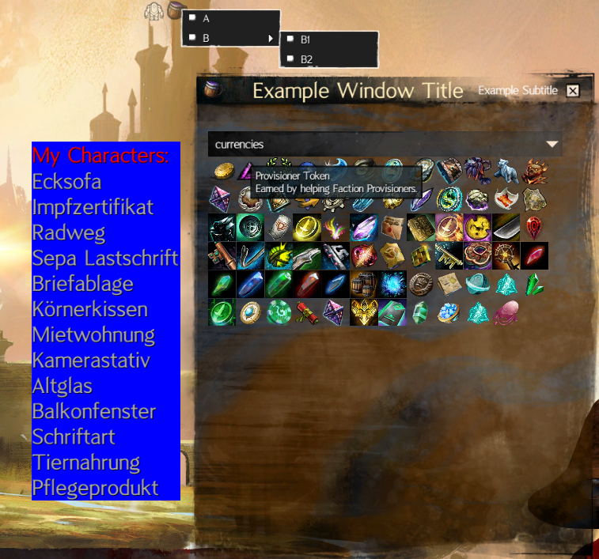

# Example-Blish-HUD-Module

*Please note that these instructions are subject to change as the project moves forward as new features are implemented.*

## Setup

1. Install Visual Studio 2022 if dont have it yet. The community version is free: https://visualstudio.microsoft.com/de/downloads/
1. Download the newest Blish HUD version from the website and extract the blish zip: https://blishhud.com/
1. Download the example module code or use git clone.
1. Change the executablePath in \ExampleBlishhudModule\Properties\launchSettings.json to where the blishhud.exe from the extracted blish zip is.
1. Open the ExampleBlishhudModule.sln in Visual Studio. 
1. Right-click on the Solution icon in the Solution Explorer and select **Restore Nuget packages** (may not be necessary when using visual studio 2022)
1. Start Guild Wars 2.
1. In the visual studio menu bar click on the dropdown next to the green arrow. Select "gw2".
1. Press the green arrow to start blish with the example module in debug mode. It will overlay Guild Wars 2.

You can overlay a powershell or other window instead of gw2, too. But when you dont overlay gw2, api keys will not work in blish because gw2 mumble link cannot be accessed by blish. Overlaying something else than gw2 can be still usefull for debugging modules.
Additional infos for debugging ("Configuring Your Project" can be ignored): https://blishhud.com/docs/modules/overview/debugging

