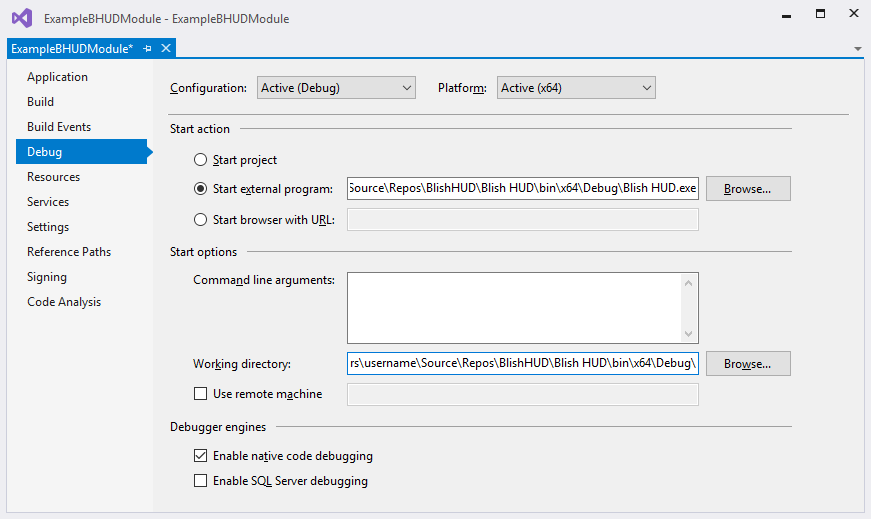

# Example-Blish-HUD-Module

*Please note that these instructions are subject to change as the project moves forward as new features are implemented.*

## Setup

1. Download the newest Blish HUD version from the website: https://blishhud.com/
2. Download the example module code or use git checkout.
3. Change the executablePath in \ExampleBlishhudModule\Properties\launchSettings.json to where the blishhud.exe from step 1 is.
4. Open the ExampleBHUDModule.sln in Visual Studio. 
5. Right-click on the Solution icon in the Solution Explorer and select **Restore Nuget packages** (may not be necessary when using visual studio 2022)
6. Start Guild Wars 2 or open a powershell window depending on what blish should overlay. (powershell will not work with api keys because gw2 mumble link is not running, but is still usefull for debugging modules)
6. In the visual studio menu bar click on the dropdown next to the green arrow. Select "gw2" or "powershell" depending on what blish should overlay.
7. Press the green arrow to start blish with the example module in debug mode. It will overlay Guild Wars 2 or the powershell window depending on what you picked in the previous steps.

Additional infos for debugging: https://blishhud.com/docs/modules/overview/debugging 
